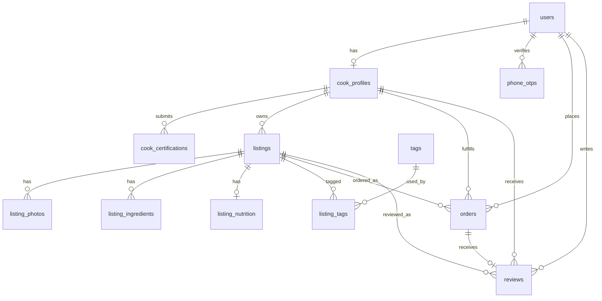

# Database Overview

This app uses Neon Postgres with Drizzle ORM. The runtime client is created in
`db/index.ts` with `@neondatabase/serverless`, and Drizzle reads the schema
barrel from `db/schema/index.ts`.

## Workflow

Required environment:

- `DATABASE_URL`: Neon Postgres connection string. Keep it in `.env.local` and
  do not print it in logs or terminal output.

Common commands from `my-app/`:

```bash
pnpm db:generate           # Generate migration files from Drizzle schema
pnpm db:migrate            # Apply generated migrations
pnpm exec drizzle-kit push # Push current schema directly to Neon
```

When changing `db/schema/**`, run Drizzle against Neon before calling the work
complete. For quick schema iteration in this project, use `pnpm exec
drizzle-kit push` with `DATABASE_URL` loaded from `.env.local`.

## Schema Files

- `db/schema/enums.ts`: shared enum types.
- `db/schema/users.ts`: users and phone OTPs.
- `db/schema/cooks.ts`: cook profiles and certifications.
- `db/schema/listings.ts`: listings, listing content, tags, and join tables.
- `db/schema/orders.ts`: orders and reviews.
- `db/schema/waitlist.ts`: landing-page waitlist and rate-limit log.
- `db/schema/index.ts`: exports all schema modules for Drizzle and app code.

## Core Tables

### Users And Auth

`users` stores app accounts.

- Primary key: `id`.
- Role enum: `client`, `cook`, `admin`.
- Status enum: `pending`, `active`, `suspended`, `banned`.
- Unique fields: `phone`, optional `email`.
- RLS: users can select/update themselves; admins can select/delete users;
  service role can insert users.

`phone_otps` stores one-time phone verification codes.

- Optional `user_id` references `users.id` with cascade delete.
- RLS: service role only.

### Cooks

`cook_profiles` is the cook-facing profile table.

- One-to-one with `users` through unique `user_id`.
- Deleting the user cascades to the profile.
- Review metadata (`reviewed_by`) is set null if the reviewer user is deleted.
- RLS: active profiles are readable; cooks can update their own profile;
  service role can insert; admins can update.

`cook_certifications` stores certification documents for a cook.

- References `cook_profiles.id` with cascade delete.
- Status enum: `pending_review`, `approved`, `rejected`.
- RLS: cooks can read/insert their own certs and delete pending certs;
  approved certs are readable; admins can read/update.

### Listings

`listings` represents meals or menu items offered by cooks.

- References `cook_profiles.id` with cascade delete.
- Status enum: `draft`, `pending_review`, `active`, `archived`.
- Pricing uses `numeric(10, 2)` and defaults to `CAD`.
- RLS: active listings are public; cooks can read/insert/update their own
  listings; admins can read/update; cooks can delete only their own drafts.

Listing detail tables:

- `listing_photos`: photos for a listing.
- `listing_ingredients`: ingredient rows and allergen flags.
- `listing_nutrition`: one optional nutrition record per listing.
- `listing_tags`: many-to-many join between listings and tags.
- `tags`: globally readable tags; admin-only writes.

Listing detail tables generally cascade when their parent listing is deleted.
Reads are public when the parent listing is active, and owner-scoped otherwise.

### Orders And Reviews

`orders` connects clients, listings, and cooks.

- `client_id` references `users.id` with restrict delete.
- `listing_id` references `listings.id` with restrict delete.
- `cook_id` references `cook_profiles.id` with restrict delete.
- Status enum: `pending`, `confirmed`, `ready`, `fulfilled`, `cancelled`.
- `cancelled_by` references `users.id` and is set null if that user is deleted.
- RLS: clients, assigned cooks, and admins can read relevant orders.
- Client updates are limited to old `pending` rows and new `pending` or
  `cancelled` rows.
- Cook updates are limited to their own orders, from operational states into
  operational/cancelled states.

`reviews` is one review per order.

- Unique `order_id`; deleting an order cascades to its review.
- References client, cook, and listing with restrict delete.
- `rating` is constrained by `reviews_rating_range` to `1..5`.
- RLS: visible reviews are public; participants can read their own; clients can
  insert for fulfilled orders; clients can update their own reviews; admins can
  read/update.

## Waitlist Tables

`waitlist` stores landing-page signups.

- Unique `email`.
- Stores `ip_hash` for abuse tracking without keeping raw IPs.

`rate_limit_log` stores hashed-IP attempts.

- Used by `lib/rate-limit.ts` to enforce `RATE_LIMIT_WINDOW_MINUTES` and
  `RATE_LIMIT_MAX_ATTEMPTS`.

## RLS Conventions

- Tables with policies call `.enableRLS()`.
- Admin checks use:
  `auth.jwt() -> 'app_metadata' ->> 'role' = 'admin'`.
- Service-role checks use:
  `auth.role() = 'service_role'`.
- Owner checks compare `auth.uid()` with `users.id` or traverse through
  `cook_profiles.user_id`.

## Relationship Summary



## Update Timestamp Convention

Mutable tables use `updatedAt` with:

```ts
timestamp("updated_at").notNull().defaultNow().$onUpdate(() => new Date())
```

This updates timestamps for Drizzle ORM updates. If other database clients update
these tables directly, add database triggers instead of relying only on Drizzle
runtime behavior.
